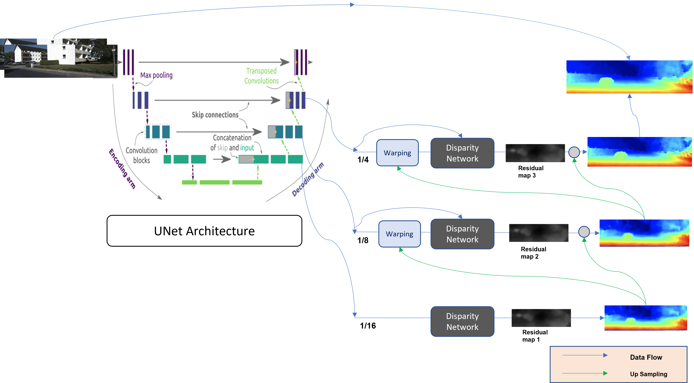

# Modified Anytime Stereo Image Depth Estimation with Additional Decoder

This is a Modified repository, it is based on the original ["Anytime Stereo Image Depth Estimation on Mobile Devices"](https://github.com/mileyan/AnyNet) by Yan Wang, Zihang Lai, Gao Huang, Brian Wang, Laurens van der Maaten, Mark Campbell, and Kilian Q. Weinberger. The original work has been accepted by the International Conference on Robotics and Automation (ICRA) in 2019.

## Modifications

In this Branch, the original AnyNet model has undergone experimentation and enhancements as part of a class project. The primary modification involves the addition of an extra decoder for the model, and decoder aggregation techniques have been applied.

## Model


## Changes Made

1. **Additional Decoder:**
   An extra decoder has been integrated into the AnyNet model architecture. This modification aims to explore the impact of multiple decoders on the stereo image depth estimation task.

2. **Decoder Aggregation:**
   Techniques for decoder aggregation have been implemented to leverage the outputs of both the original and the added decoder. This experimentation is conducted to enhance the depth estimation results and explore potential improvements in accuracy.

## Usage

Refer to the [Original_repo](https://github.com/mileyan/AnyNet) for usage.

Refer to the [Original_paper](https://arxiv.org/abs/1810.11408) for understanding.

Refer to the [Unoffical_repo](https://github.com/gyes00205/AnyNet/) for more implementation.

## Contributors

The following classmates have contributed to this project:

- [Akshara Trichambaram](mailto:atricham@asu.edu)
- [Nivina Christy](mailto:nchris17@asu.edu)
- [Roop Sumanth Gundu](mailto:rgundu2@asu.edu)

## Results and Evaluation

As a result of the modifications, new evaluation metrics and results are provided. The README includes details on how to assess the performance of the modified AnyNet model on various datasets. Additionally, insights into the impact of the extra decoder and decoder aggregation on depth estimation accuracy are discussed.

You can also look into our [Report](Anytime_Stereo_Image_Depth_Estimation_TEAM14_Akshara_Anirudh_Nivina_Roop-2.pdf)


## Citation

If you find this work useful, please consider citing the original paper:

```latex
@article{wang2018anytime,
  title={Anytime Stereo Image Depth Estimation on Mobile Devices},
  author={Wang, Yan and Lai, Zihang and Huang, Gao and Wang, Brian H. and Van Der Maaten, Laurens and Campbell, Mark and Weinberger, Kilian Q},
  journal={arXiv preprint arXiv:1810.11408},
  year={2018}
}
```

## Acknowledgments

We acknowledge the original authors for their valuable contribution to stereo image depth estimation. The enhancements in this fork are experimental and aim to contribute to the exploration of advanced techniques in the field.

Feel free to explore the modified code, experiment with the new features, and contribute to further advancements in stereo depth estimation with AnyNet!


---
